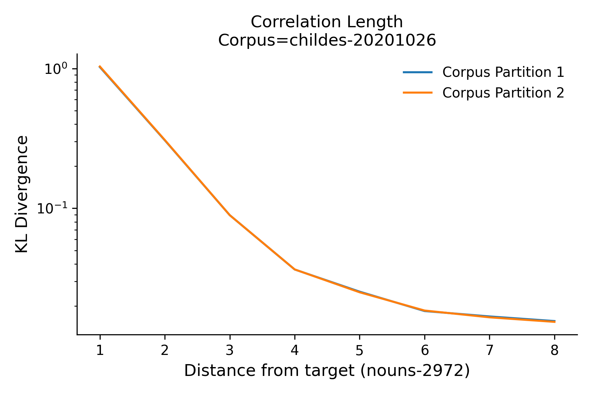

# CorrelationLength

This repository contains a Python script to estimate the correlation length between a subset (e.g. nouns) of words in a corpus of 5M words of child-directed speech.

## About

A simple tool to plot the correlation length. 

The correlation length is the distance at which inter-word dependence falls to zero. once the distance exceeds the correlation length, it is as if all words are effectively independent. At this point, the conditional entropy equals the entropy.

The figure below shows that the correlation length for nouns in a corpus of English child-directed speech is approximately 8, where the KL divergence converges on the unconditional entropy.



Corpus partition 1 and 2 refer to speech to younger and older children, respectively. 

## Custom Dependencies

To install `preppy`, 

```bash
pip instal git+https://github.com/phueb/Preppy.git```
